# Churn Risk API: CI/CD on AWS

A bank churn model served as an API, tested and deployed automatically on every `git push`.
The XGBoost model comes from my [bank churn analysis](https://github.com/notzenotz/bank-churn-prediction); this project takes it from a notebook to a running service.

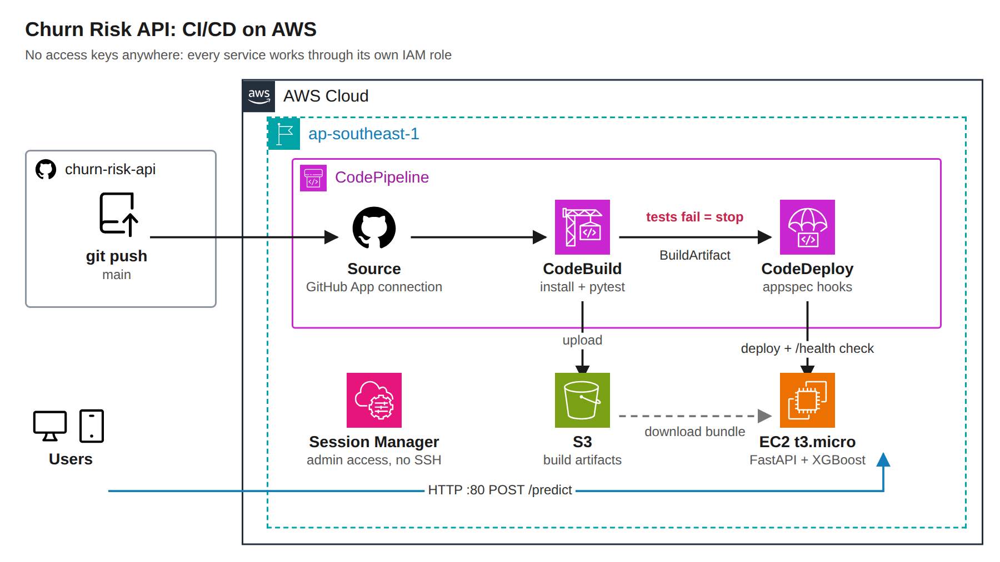

## What it does

Send one customer, get back how likely they are to leave the bank:

```bash
curl -X POST http://<server-ip>/predict -H "Content-Type: application/json" -d '{
  "credit_score": 650, "geography": "Germany", "gender": "Female", "age": 58, "tenure": 2,
  "balance": 130000, "num_of_products": 4, "has_cr_card": true,
  "is_active_member": false, "estimated_salary": 30000
}'
```

```json
{"churn_risk": 0.9994, "at_risk": true, "risk_level": "high", "threshold": 0.5, "model_version": "1.1.0"}
```

A young, active customer with two products in France scores `0.0252` (`low`).

| Endpoint | Purpose |
|---|---|
| `GET /health` | Liveness check, used by the deployment to decide success or failure |
| `POST /predict` | Churn risk score, label and threshold for one customer |
| `GET /docs` | Interactive documentation generated by FastAPI |

## How a change reaches production

1. **Source:** a push to `main` triggers CodePipeline through a GitHub App connection limited to this repository.
2. **Build:** CodeBuild installs the dependencies and runs 7 pytest tests ([buildspec.yml](buildspec.yml)). Test results are published as a CodeBuild test report. **If any test fails, the pipeline stops here** and no artifact is produced.
3. **Deploy:** CodeDeploy copies the build artifact to the EC2 instance and runs four hooks ([appspec.yml](appspec.yml)): stop the old version, install dependencies, start the service with systemd, then call `/health` for up to a minute. If the API does not answer, the deployment fails and rolls back automatically.

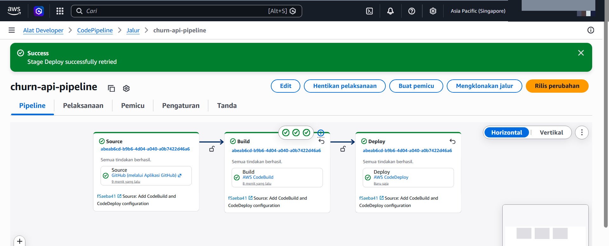

## The test gate in action

To prove the gate works, I pushed a deliberate bug (a wrong high-risk cutoff) without testing it locally:

- CodeBuild failed on `test_risk_level_labels` (6 passed, 1 failed) and Deploy never ran.
- The live API kept serving the previous, correct version the whole time.
- `git revert` pushed the fix and the pipeline went green again.

| Pipeline blocked | Failed test report |
|---|---|
| 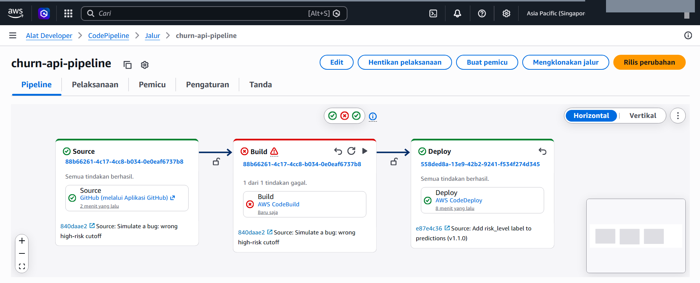 | 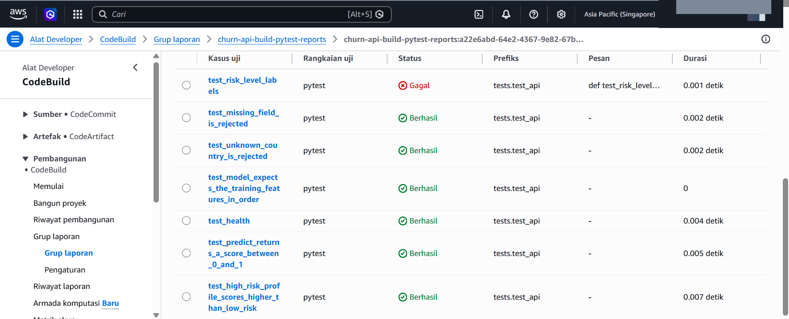 |

## Security choices

- **No access keys anywhere.** CodePipeline, CodeBuild, CodeDeploy and the EC2 instance each use their own IAM role.
- **Least privilege.** The pipeline role may only deploy the `churn-api` application; the instance may only read pipeline artifacts from S3.
- **No SSH.** Port 22 is closed and the instance has no key pair. Admin access goes through Systems Manager Session Manager, protected by the AWS login.
- **Only port 80 is open**, for the API itself.

## Problems I ran into

- **CodeDeploy was locked on the AWS Free plan.** I upgraded the account to the Paid plan; the remaining Free Tier credits still apply.
- **`not authorized to perform codedeploy:CreateDeployment`.** The pipeline was first created without a Deploy stage, so its generated role had no CodeDeploy permissions. I added an inline policy scoped to this one application and deployment group.
- **`Input Artifact BuildArtifact ... is not declared`.** The Build action had no output artifact, so Deploy had nothing to receive. Declaring `BuildArtifact` as the build output fixed it.
- **Shell scripts written on Windows.** `.gitattributes` forces Linux line endings and `git update-index --chmod=+x` marks the hook scripts as executable.

## Run it locally

```powershell
python -m venv .venv
.\.venv\Scripts\Activate.ps1
pip install -r requirements-dev.txt
pytest -v
uvicorn app.main:app --reload     # then open http://127.0.0.1:8000/docs
```

## Project structure

```
app/                  FastAPI app and model loading (same feature engineering as the notebook)
model/                trained XGBoost model and the feature order it expects
tests/                7 pytest tests: API behaviour, validation, model sanity, risk labels
buildspec.yml         CodeBuild: install, test, package
appspec.yml           CodeDeploy: file destination and lifecycle hooks
scripts/              stop, install, start and validate hooks
deploy/               systemd unit that keeps the API running on port 80
```

## Limitations and next steps

- Served over plain HTTP. In production it would sit behind an Application Load Balancer with an HTTPS certificate from AWS Certificate Manager.
- One instance, so a deployment briefly interrupts the API. Two instances behind a load balancer would allow rolling or blue/green deployments.
- The API is open to anyone who knows the address. An API key stored in AWS Secrets Manager would restrict it.
- The infrastructure was created in the console. Writing it in Terraform, as I did for my [portfolio hosting](https://dz3rh3ycwu2ta.cloudfront.net), would make it reproducible.
- The server is stopped when not in use to save cost, so its public IP changes between demos.

<details>
<summary>More screenshots</summary>

| | |
|---|---|
| Local tests, 7 passed | 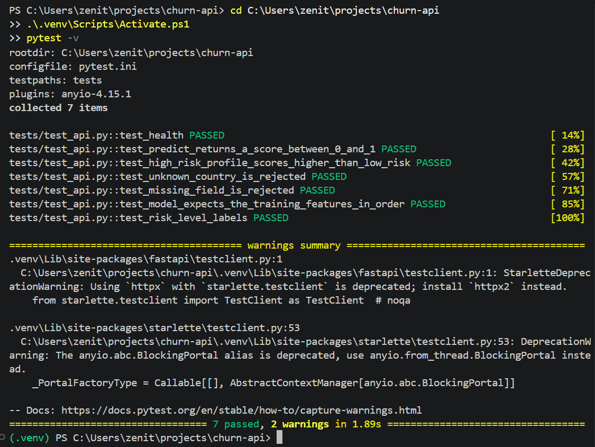 |
| EC2 instance running | 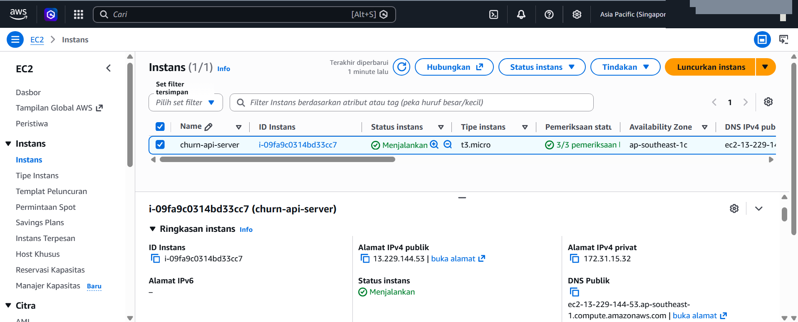 |
| Server ready (CodeDeploy agent, Python) | 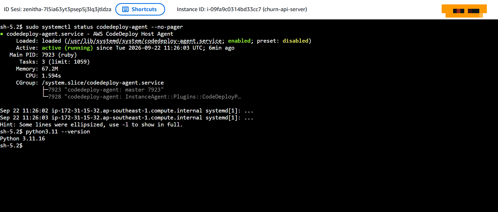 |
| Deployment group | 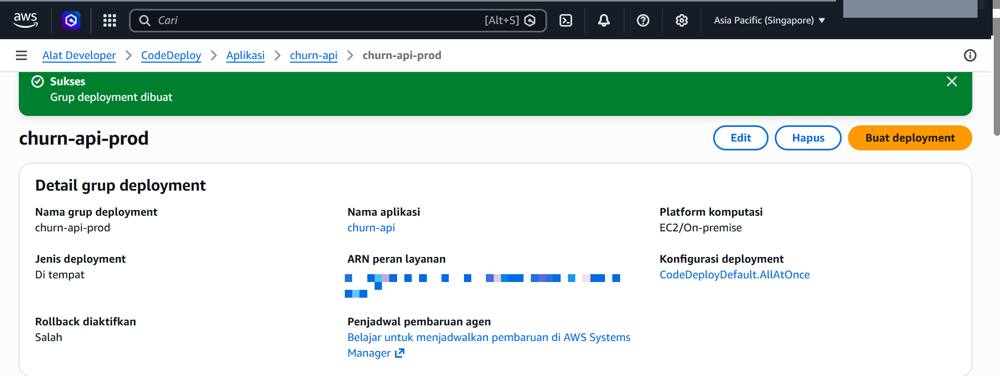 |
| Test report, 7 passed | 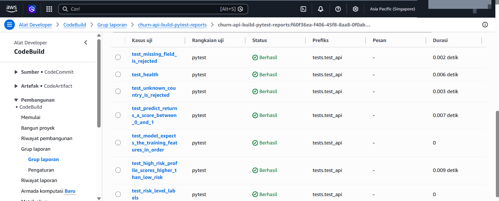 |
| API live on EC2 | 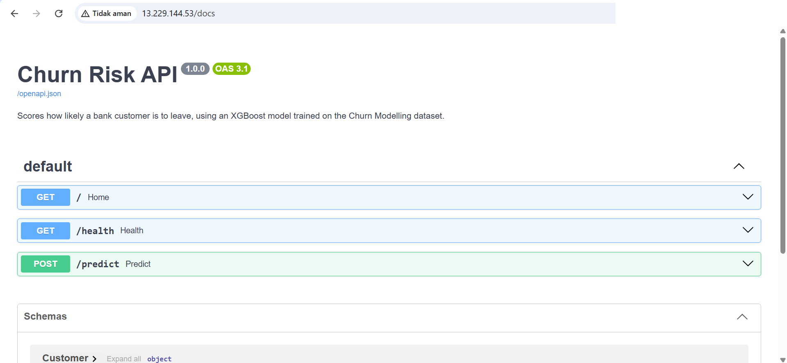 |
| Automatic deploy of v1.1.0 |  |
| High-risk prediction on v1.1.0 | 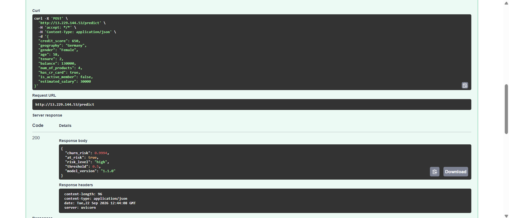 |
| Low-risk prediction on v1.1.0 |  |
| API untouched during the failed build | 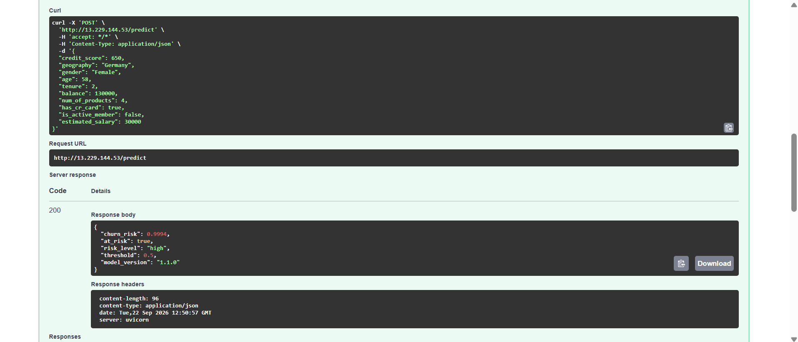 |
| Pipeline green after the revert | 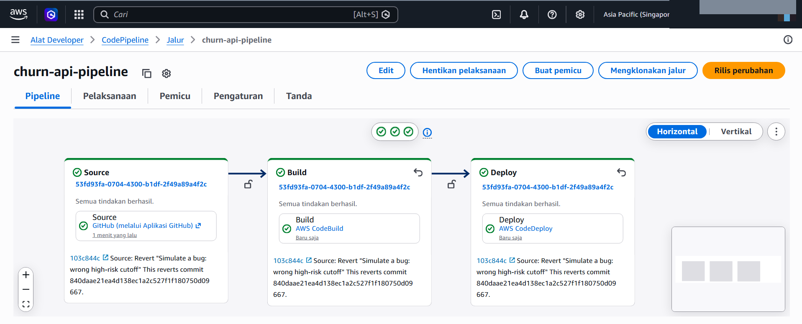 |

</details>

## Tools

Python, FastAPI, XGBoost, pytest, AWS CodePipeline, CodeBuild, CodeDeploy, EC2, S3, IAM, Systems Manager, systemd

---

Architecture icons: [AWS Architecture Icons](https://aws.amazon.com/architecture/icons/) and [GitHub Octicons](https://github.com/primer/octicons).
Made by **Winodya Zenitha** · [LinkedIn](https://www.linkedin.com/in/winodya-zenitha/) · [Portfolio](https://dz3rh3ycwu2ta.cloudfront.net)
